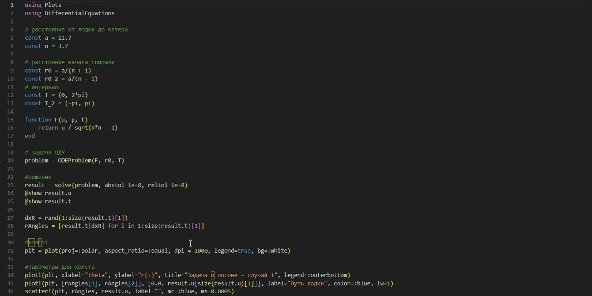
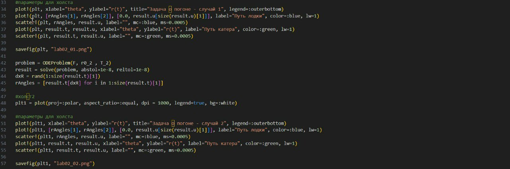
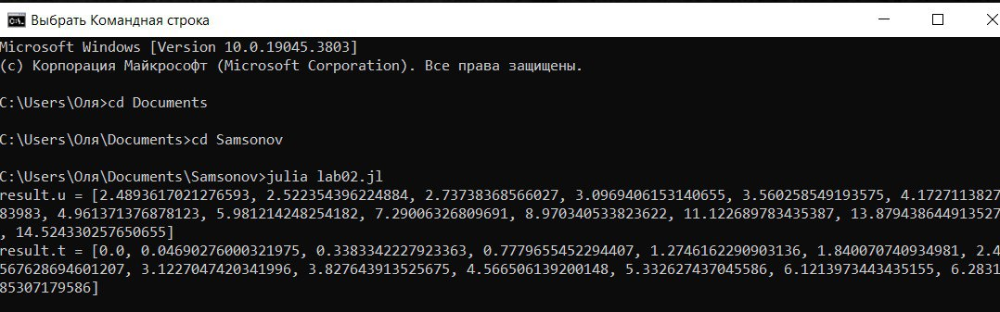
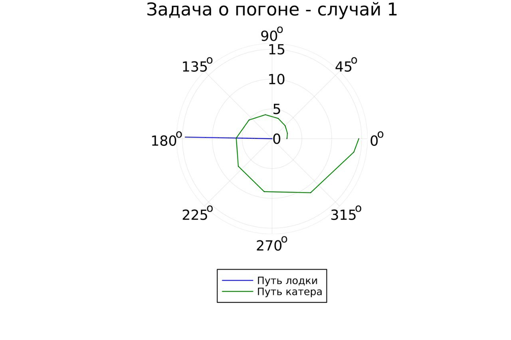
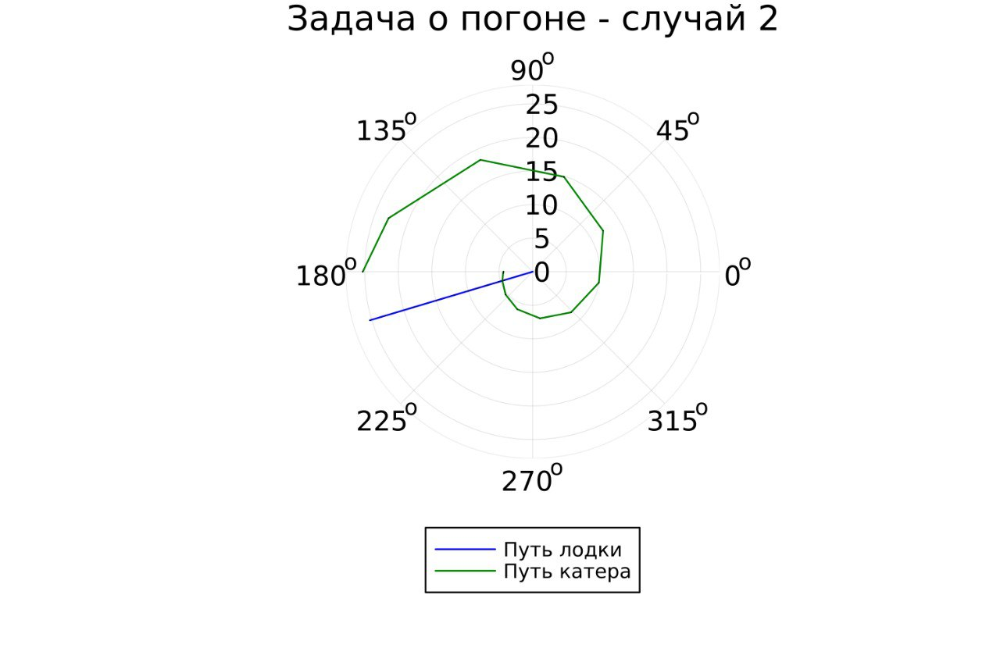

---
## Front matter
lang: ru-RU
title: "Презентация по лабораторной работе №2"
subtitle: "Задача о погоне"
author:
  - Самсонова Мария
institute:
  - Российский университет дружбы народов, Москва, Россия
date: 16 февраля 2024

## i18n babel
babel-lang: russian 
babel-otherlangs: english 
mainfont: Arial 
monofont: Courier New 
fontsize: 12pt

## Formatting pdf
toc: false
toc-title: Содержание
slide_level: 2
aspectratio: 169
section-titles: true
theme: metropolis
header-includes:
 - \metroset{progressbar=frametitle,sectionpage=progressbar,numbering=fraction}
 - '\makeatletter'
 - '\beamer@ignorenonframefalse'
 - '\makeatother'
---

# Цель лабораторной работы №2

Изучение основ языков программирования Julia и OpenModelica и освоение библиотек данных языков, которые необходимы для построения графиков и решение дифференциальных уравнений.

# Задание

1. Запишите уравнение, описывающее движение катера, с начальными
условиями для двух случаев (в зависимости от расположения катера относительно лодки в начальный момент времени).
2. Постройте траекторию движения катера и лодки для двух случаев.
3. Найдите точку пересечения траектории катера и лодки.

# Вычисление собственного варианта

{ #fig:001 width=70% }

# Решение задачи 

$$ t = {{x }\over{v}} $$
$$ t = {{11,7-x}\over{3,7 v}} $$
$$ t = {{11,7+x}\over{3,7 v}} $$

# Решение уравнений

Из этих уравнений получаем объедиение двух уравнений:

$$ \left[ \begin{array}{cl}
{{x}\over{v}} = {{11,7-x}\over{3,7 v}}\\
{{x}\over{v}} = {{11,7+x}\over{3,7 v}}
\end{array} \right. $$

Решая данные уравнения, получаем два значения для x:
$x_1 = {{117}\over{47}}$, $x_2 = {{13}\over{3}}$

# Решение задачи
$$ v_\tau  $$ – тангенциальная скорость
$$ v $$ – радиальная скорость
$$ v = {dr\over dt} $$
$$ v_\tau = {{\sqrt{((3,7*v)^2-v^2)}}} = {\sqrt{141}*3v \over{5}}   $$

# Решение задачи
$$ \left\{ \begin{array}{cl}
{dr\over dt} = v \\
r{d\theta\over dt} = {{\sqrt{141}*3v}\over{10}}
\end{array} \right. $$

# Начальные условия

$$ \left\{ \begin{array}{cl}
\theta_0 = 0 \\
r_0 = x_1 = {{117}\over{47}}
\end{array} \right. $$

*или*

$$ \left\{ \begin{array}{cl}
\theta_0 = -\pi \\
r_0 = x_2 = {{13}\over{3}}
\end{array} \right. $$

# Итоговое уравнение

$$ {dr\over d\theta} = {{10r\over\sqrt{141}}\over{423}} $$

# Решение задачи с помощью Julia.

Используя библиотеку DifferentialEquations, мы в данной программе решаем дифференциальное уравнение, расписанное в постановке задачи лабораторной работы. Благодаря библиотеке Plots мы получаем Итоговые изображения в полярных координатах. [1]

Установим Julia:

{#fig:002}

# Установка библиотек для Julia. Часть 1.

Установим нужные библиотеки, проверим их установку:

{#fig:003}

# Установка библиотек для Julia. Часть 2.

{#fig:004}

# Код программы. Часть 1.

{#fig:005}

# Код программы. Часть 2.

{#fig:006}

# Компиляция файла.

{#fig:007}

# Результаты работы кода на Julia. Часть 1

На рис. @fig:008 и @fig:009 изображены итоговые графики траектории движения катера и лодки для случая обоих случаев.

{#fig:008}

# Результаты работы кода на Julia. Часть 2.

{#fig:009}

# Выводы

В данной лабораторной работе №2 мы потроили графики для обоих случаев, где отрисованы траектории лодки и катера и наглядно показали пересечения. Таким образом, успешно решили поставленную задачу.

Также изучили основы языков программирования Julia и освоили библиотеки данного языка, которые необходимы для построения графиков и решение дифференциальных уравнений. Однако из-за отсутствия возможности работы языка OpenModeica с полярными координатами мы не смогли приобрести опыт.