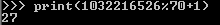
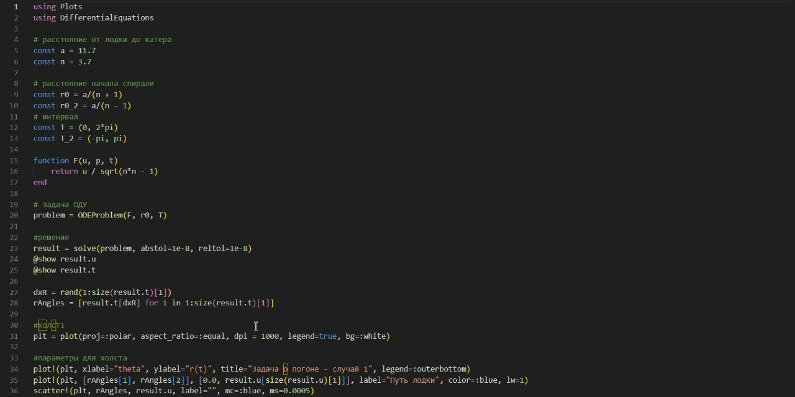
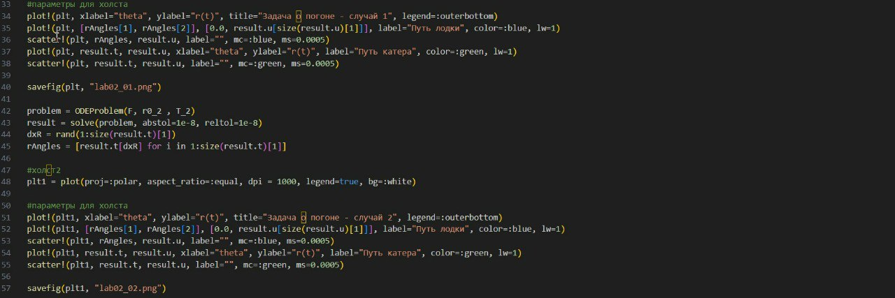
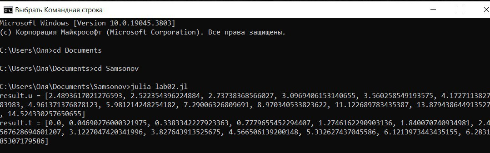
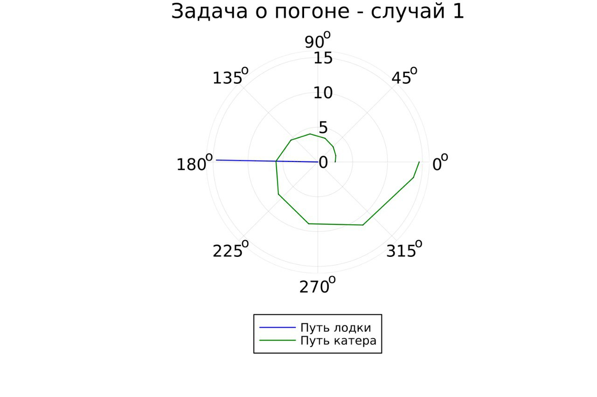

---
## Front matter
title: "Отчёт по лабораторной работе №2

Математическое моделирование"
subtitle: "Задача о погоне. Вариант №27"
author: "Выполнила: Самсонова Мария Ильинична, 

НФИбд-02-21, 1032216526"

## Generic otions
lang: ru-RU
toc-title: "Содержание"

## Bibliography
bibliography: bib/cite.bib
csl: pandoc/csl/gost-r-7-0-5-2008-numeric.csl

## Pdf output format
toc: true # Table of contents
toc-depth: 2
lof: true # List of figures
fontsize: 12pt
linestretch: 1.5
papersize: a4
documentclass: scrreprt
## I18n polyglossia
polyglossia-lang:
  name: russian
  options:
	- spelling=modern
	- babelshorthands=true
polyglossia-otherlangs:
  name: english
## I18n babel
babel-lang: russian
babel-otherlangs: english
## Fonts
mainfont: Arial
romanfont: PT Serif
sansfont: PT Sans
monofont: Courier New
mainfontoptions: Ligatures=TeX
romanfontoptions: Ligatures=TeX
sansfontoptions: Ligatures=TeX,Scale=MatchLowercase
monofontoptions: Scale=MatchLowercase,Scale=0.9
## Biblatex
biblatex: true
biblio-style: "gost-numeric"
biblatexoptions:
  - parentracker=true
  - backend=biber
  - hyperref=auto
  - language=auto
  - autolang=other*
  - citestyle=gost-numeric
## Pandoc-crossref LaTeX customization
figureTitle: "Рис."
tableTitle: "Таблица"
listingTitle: "Листинг"
lofTitle: "Список иллюстраций"
lolTitle: "Листинги"
## Misc options
indent: true
header-includes:
  - \usepackage{indentfirst}
  - \usepackage{float} # keep figures where there are in the text
  - \floatplacement{figure}{H} # keep figures where there are in the text
---

# Цель лабораторной работы №2

Изучение основ языков программирования Julia и OpenModelica и освоение библиотек данных языков, которые необходимы для построения графиков и решение дифференциальных уравнений.

# Теоретические данные 

**Информация о языках программирования:**

- Julia — высокоуровневый высокопроизводительный свободный язык программирования с динамической типизацией, созданный для математических вычислений. Эффективен также и для написания программ общего назначения. Синтаксис языка схож с синтаксисом других математических языков (например, MATLAB и Octave), однако имеет некоторые существенные отличия. Julia написан на Си, C++ и Scheme. Имеет встроенную поддержку многопоточности и распределённых вычислений, реализованные в том числе в стандартных конструкциях.

- OpenModelica — свободное открытое программное обеспечение для моделирования, симуляции, оптимизации и анализа сложных динамических систем. Основано на языке Modelica. Активно развивается Open Source Modelica Consortium, некоммерческой неправительственной организацией. Open Source Modelica Consortium является совместным проектом RISE SICS East AB и Линчёпингского университета. По своим возможностям приближается к таким вычислительным средам как Matlab Simulink, Scilab xCos, имея при этом значительно более удобное представление системы уравнений исследуемого блока.

**Математические термины:**

- Дифференциальное уравнение — уравнение, которое помимо функции содержит её производные. Порядок входящих в уравнение производных может быть различен (формально он ничем не ограничен). Производные, функции, независимые переменные и параметры могут входить в уравнение в различных комбинациях или отсутствовать вовсе, кроме хотя бы одной производной. Не любое уравнение, содержащее производные неизвестной функции, является дифференциальным. 

В отличие от алгебраических уравнений, в результате решения которых ищется число (несколько чисел), при решении дифференциальных уравнений ищется функция (семейство функций).

Дифференциальное уравнение порядка выше первого можно преобразовать в систему уравнений первого порядка, в которой число уравнений равно порядку исходного дифференциального уравнения. 

- Тангенциальная скорость - составляющая вектора скорости, перпендикулярная линии, соединяющей источник и наблюдателя. Измеряется собственному движению - угловому перемещению источника.
- Радиальная скорость — проекция скорости точки на прямую, соединяющую её с выбранным началом координат.
- Полярная система координат — двумерная система координат, в которой каждая точка на плоскости определяется двумя числами — полярным углом и полярным радиусом.

# Задание лабораторной работы №2

1. Вычислите собственный вариант:
(исходя из формулы $N_{student} mod K_{of variants} + 1$).

Этот же вариант будет использоваться для всех последующих лабораторных работ.

{#fig:001}

*Условия задачи о погоне, 27 вариант:*

***На море в тумане катер береговой охраны преследует лодку браконьеров.Через определенный промежуток времени туман рассеивается, и лодка обнаруживается на расстоянии 11,7 км от катера. Затем лодка снова скрывается в тумане и уходит прямолинейно в неизвестном направлении. Известно, что скорость катера в 3,7 раза больше скорости браконьерской лодки.***

2. Запишите уравнение, описывающее движение катера, с начальными
условиями для двух случаев (в зависимости от расположения катера относительно лодки в начальный момент времени).
3. Постройте траекторию движения катера и лодки для двух случаев.
4. Найдите точку пересечения траектории катера и лодки 3. 

# Выполнение лабораторной работы №2

## Информация о математической модели

1. Примем за момент отсчета времени момент первого рассеивания тумана. Введем полярные координаты с центром в точке нахождения браконьеров
и осью, проходящей через катер береговой охраны. Тогда начальные координаты катера (11,7; 0). Обозначим скорость лодки $v$.
2. Траектория катера должна быть такой, чтобы и катер, и лодка все время были на одном расстоянии от полюса. Только в этом случае траектория катера пересечется с траекторией лодки. Поэтому для начала катер береговой охраны должен двигаться некоторое время прямолинейно, пока не окажется на том же расстоянии от полюса, что и лодка браконьеров. После этого катер береговой охраны должен двигаться вокруг полюса удаляясь от него с той же скоростью, что и лодка браконьеров.
3. Чтобы найти расстояние x (расстояние после которого катер начнет двигаться вокруг полюса), необходимо составить следующие уравнение. Пусть через время t катер и лодка окажутся на одном расстоянии x от полюса. За это время лодка пройдет $x$, а катер $11,7 + x$ (или $11,7 - x$, в зависимости от начального положения катера относительно полюса). Время, за которое они пройдут это расстояние, вычисляется как $x\over v$ или ${11,7 - x}\over{3,7v}$ (${11,7 + x}\over{3,7v}$). Так как время должно быть одинаковым, эти величины тоже будут друг другу равны. Из этого получаем объединение из двух уравнений (двух из-за двух разных изначальных позиций катера относительно полюса):

$$ \left[ \begin{array}{cl}
{{x}\over{v}} = {{11,7 - x}\over{3,7v}}\\
{{x}\over{v}} = {{11,7 + x}\over{3,7v}}
\end{array} \right. $$

Из данных уравнений можно найти расстояние, после которого катер начнёт раскручиваться по спирали. Для данных уравнений решения будут следующими: $x_1 = {{117}\over{47}}$, $x_2 = {{13}\over{3}}$. Задачу будем решать для двух случаев. После того, как катер береговой охраны окажется на одном расстоянии от полюса, что и лодка, он должен сменить прямолинейную траекторию и начать двигаться вокруг полюса удаляясь от него со скоростью лодки v. Для этого скорость катера раскладываем на две составляющие: $v_r = {dr\over dt} = v$ - радиальная скорость и $v_\tau = r{d\theta\over dt}$ - тангенциальная скорость.

$$ v_\tau = {{\sqrt{141}*3v}\over{10}} $$

4. Решение исходной задачи сводится к решению системы из двух дифференциальных уравнений:

$$ \left\{ \begin{array}{cl}
{dr\over dt} = v \\
r{d\theta\over dt} = {{\sqrt{141}*3v}\over{10}}
\end{array} \right. $$

с начальными условиями 

$$ \left\{ \begin{array}{cl}
\theta_0 = 0 \\
r_0 = x_1 = {{117}\over{47}}
\end{array} \right. $$

или

$$ \left\{ \begin{array}{cl}
\theta_0 = -\pi \\
r_0 = x_2 = {{13}\over{3}}
\end{array} \right. $$

Исключая из полученной системы производную по t, можно перейти к следующему уравнению (с неизменными начальными условиями):

$$ {dr\over d\theta} = {{10r\over\sqrt{141}}\over{423}} $$

Решением этого уравнения с заданными начальными условиями и будет являться траектория движения катера в полярных координатах. [3]

# Практическая часть. Решение задачи с помощью программ

## Openmodelica

В данной программе не используются полярные координаты, поэтому мы не можем решить данную задачу с помощью данной программы.

## Julia

Используя библиотеку DifferentialEquations, мы в данной программе решаем дифференциальное уравнение, расписанное в постановке задачи лабораторной работы. Благодаря библиотеке Plots мы получаем Итоговые изображения в полярных координатах. [1]

Установим Julia:

{#fig:002}

Установим нужные библиотеки, проверим их установку:

{#fig:003}

{#fig:004}

Код программы:

{#fig:005}

{#fig:006}

Скомпилируем файл командной в Командной строке:

{#fig:007}

### Результаты работы кода на Julia

На рис. @fig:008 и @fig:009 изображены итоговые графики траектории движения катера и лодки для случая обоих случаев.

{#fig:008}

{#fig:009}

# Анализ итоговых результатов и вывод

В данной лабораторной работе №2 мы потроили графики для обоих случаев, где отрисованы траектории лодки и катера и наглядно показали пересечения. Таким образом, успешно решили поставленную задачу.

Также изучили основы языков программирования Julia и освоили библиотеки данного языка, которые необходимы для построения графиков и решение дифференциальных уравнений. Однако из-за отсутствия возможности работы языка OpenModeica с полярными координатами мы не смогли приобрести опыт.

# Список литературы. Библиография

[1] Документация по Julia: https://docs.julialang.org/en/v1/

[2] Документация по OpenModelica: https://openmodelica.org/

[3] Решение дифференциальных уравнений: https://www.wolframalpha.com/