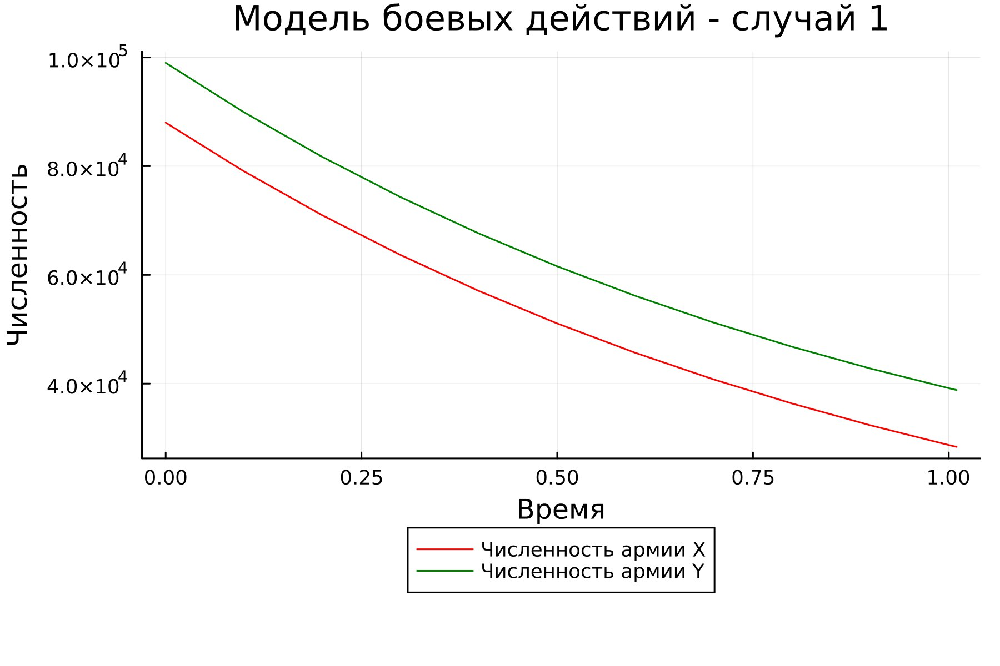
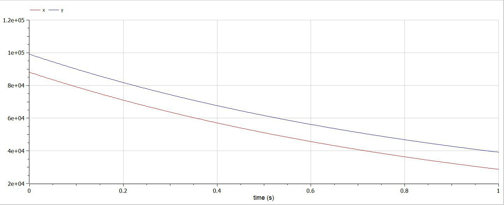
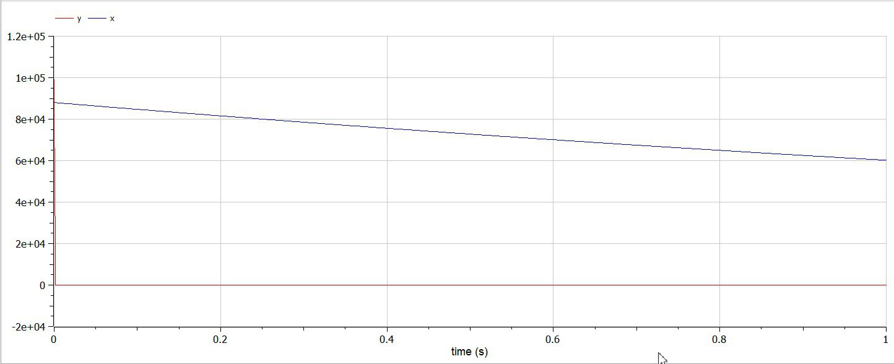

---
## Front matter
lang: ru-RU
title: "Презентация по лабораторной работе №3"
subtitle: " Модель боевых действий "
author:
  - Самсонова Мария Ильинична
institute:
  - Российский университет дружбы народов, Москва, Россия
date: 23 февраля 2024

## i18n babel
babel-lang: russian 
babel-otherlangs: english 
mainfont: Arial 
monofont: Courier New 
fontsize: 12pt

## Formatting pdf
toc: false
toc-title: Содержание
slide_level: 2
aspectratio: 169
section-titles: true
theme: metropolis
header-includes:
 - \metroset{progressbar=frametitle,sectionpage=progressbar,numbering=fraction}
 - '\makeatletter'
 - '\beamer@ignorenonframefalse'
 - '\makeatother'
---


# Цель работы

Изучение модели боевых действий Ланчестера и применение их на практике для решения поставленной задачи лабораторной работы №3.

# Регулярная армия X против регулярной армии Y

$$ {dx\over {dt}} = -a(t)x(t)-b(t)y(t)+P(t) $$
$$ {dy\over {dt}} = -c(t)x(t)-h(t)y(t)+Q(t) $$

# Регулярная армия против партизанской армии


$$ {dx\over {dt}} = -a(t)x(t)-b(t)y(t)+P(t) $$
$$ {dy\over {dt}} = -c(t)x(t)y(t)-h(t)y(t)+Q(t) $$
  
# Код программы Julia

```
using Plots;
using DifferentialEquations;

function one(du, u, p, t)
    du[1] = - 0.45*u[1] - 0.55*u[2] + sin(t+15) 
    du[2] = - 0.58*u[1] - 0.45*u[2] + cos(t+3)
end

function two(du, u, p, t)
    du[1] = - 0.38*u[1] - 0.67*u[2] + sin(7*t) + 1
    du[2] = (- 0.57*u[1] - 0.39)*u[2] + cos(8*t) + 1
end

const people = Float64[88000, 99000]
const prom1 = [0.0, 1.01]
const prom2 = [0.0, 1.01]
```
# Код программы Julia

```
prob1 = ODEProblem(one, people, prom1)
prob2 = ODEProblem(two, people, prom2)

sol1 = solve(prob1, dtmax=0.1)
sol2 = solve(prob2, dtmax=0.000001)

A1 = [u[1] for u in sol1.u]
A2 = [u[2] for u in sol1.u]
T1 = [t for t in sol1.t]
A3 = [u[1] for u in sol2.u]
A4 = [u[2] for u in sol2.u]
T2 = [t for t in sol2.t]
```

# Код программы Julia

```
plt1 = plot(dpi = 300, legend= true, bg =:white)
plot!(plt1, xlabel="Время", ylabel="Численность", title="Модель боевых действий - случай 1", legend=:outerbottom)
plot!(plt1, T1, A1, label="Численность армии X", color =:red)
plot!(plt1, T1, A2, label="Численность армии Y", color =:green)
savefig(plt1, "lab03_1.png")
```


# Код программы Julia

```
plt2 = plot(dpi = 1200, legend= true, bg =:white)
plot!(plt2, xlabel="Время", ylabel="Численность", title="Модель боевых действий - случай 2", legend=:outerbottom)
plot!(plt2, T2, A3, label="Численность армии X", color =:red)
plot!(plt2, T2, A4, label="Численность армии Y", color =:green)
savefig(plt2, "lab03_2.png")
```

# Результат работы с Julia. График для первого случая

{ #fig:001 width=70% }

# Результат работы с Julia. График для второго случая 

{ #fig:002 width=70% }

# Код для первого случая в OpenModelica

```
model Lab3_1
Real x;
Real y;
Real a = 0.45;
Real b = 0.55;
Real c = 0.58;
Real d = 0.45;
Real t = time;
initial equation
x = 88000;
y = 99000;
equation
der(x) = -a*x - b*y + sin(t+15);
der(y) = -c*x - d*y + cos(t+3);
end Lab3_1;
```

# Код для второго случая в OpenModelica
```
model Lab3_2
Real x;
Real y;
Real a = 0.38;
Real b = 0.67;
Real c = 0.57;
Real d = 0.39;
Real t = time;
initial equation
x = 88000;
y = 99000;
equation
der(x) = -a*x - b*y + sin(7*t)+1;
der(y) = -c*x*y - d*y + cos(8*t)+1;
end Lab3_2;

```

# Результат работы  в OpenModelica для модели боевых действий между регулярными войсками

{#fig:004}{ #fig:003 width=70% }


# Результат работы OpenModelica для модели боевых действий между регулярной армией и партизанской армией 

{ #fig:005 width=70% }

# Анализ полученных результатов. Сравнение языков.

Исходя из данных графиков, для первой модели, то есть двух регулярных армий, противостоящих друг другу, графики на Julia и OpenModelica идентичны (с учётом использования разных графических ресурсов, разный масштаб и т.д.).

Аналогичная ситуация верна и для графиков противостояния регулярной армии армии партизанов, которые рассматривались во второй модели.

# Вывод по лабораторной работе №3

В ходе выполнения лабораторной работы №3 нам удалось построить две модели на языках Julia и OpenModelica. И мы можем сделать вывод, что язык OpenModelica более приспособлен для моделирования процессов, протекающих во времени, а также построение моделей действий на языке OpenModelica занимает горазде меньше времени и объема строк кода, чем на языке Julia.