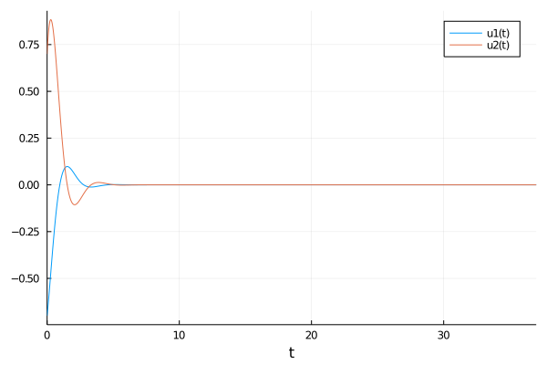

---
## Front matter
lang: ru-RU
title: "Презентация по лабораторной работе №4"
subtitle: " Модель гармонических колебаний "
author:
  - Самсонова Мария Ильинична
institute:
  - Российский университет дружбы народов, Москва, Россия
date: 1 марта 2024

## i18n babel
babel-lang: russian 
babel-otherlangs: english 
mainfont: Arial 
monofont: Courier New 
fontsize: 12pt

## Formatting pdf
toc: false
toc-title: Содержание
slide_level: 2
aspectratio: 169
section-titles: true
theme: metropolis
header-includes:
 - \metroset{progressbar=frametitle,sectionpage=progressbar,numbering=fraction}
 - '\makeatletter'
 - '\beamer@ignorenonframefalse'
 - '\makeatother'
---


# Цель лабораторной работы №4

Изучение понятия гармонического осциллятора, построение фазового портрета и нахождение решения уравнения гармонического осциллятора.

# Задание

Вариант 27:

Постройте фазовый портрет гармонического осциллятора и решение уравнения гармонического осциллятора для следующих случаев:

1. Колебания гармонического осциллятора без затуханий и без действий внешней силы $\ddot{x}+9x=0$;
2. Колебания гармонического осциллятора c затуханием и без действий внешней силы $\ddot{x}+5.5\dot{x}+4.4x=0$
3. Колебания гармонического осциллятора c затуханием и под действием внешней силы $\ddot{x}+\dot{x}+6x=2cos(0.5t)$

На интервале $t\in [0;37]$ (шаг $0.05$) с начальными условиями $x_0=-0.7, y_0=0.7$.

  
# Код программы Julia для первого случая:

```
#case 1
# x'' + 9x = 0
using DifferentialEquations

function lorenz!(du, u, p, t)
    a = p
    du[1] = u[2]
    du[2] = -a*u[1]
end

const x = -0.7
const y = 0.7
u0 = [x, y]

p = (9)
tspan = (0.0, 37.0)
prob = ODEProblem(lorenz!, u0, tspan, p)
sol = solve(prob, dtmax = 0.05)

using Plots; gr()

#решение системы уравнений
plt1 = plot(sol, dpi = 1200, legend= true, bg =:white)
plot!(plt1, title="Решение системы уравнений - 1 случай",titlefont = font(9, "Arial"), legend=:outerbottom)
savefig("lab4_julia_1.png")

#фазовый портрет
plt2 = plot(sol, vars=(2,1), dpi = 1200, legend= true, bg =:white)
plot!(plt2, title="Фазовый портрет - 1 случай", titlefont = font(9, "Arial"), legend=:outerbottom)
savefig("lab4_julia_1_phase.png")
```

# Код программы Julia для второго случая:

```
#case 2
# x'' + 5.5x' + 4.4x = 0
using DifferentialEquations

function lorenz!(du, u, p, t)
    a, b = p
    du[1] = u[2]
    du[2] = -a*du[1] - b*u[1] 
end

const x = -0.7
const y = 0.7
u0 = [x, y]

p = (sqrt(5.5), 4.4)
tspan = (0.0, 37.0)
prob = ODEProblem(lorenz!, u0, tspan, p)
sol = solve(prob, dtmax = 0.05)

using Plots; gr()

#решение системы уравнений
plt1 = plot(sol, dpi = 1200, legend= true, bg =:white)
plot!(plt1, title="Решение системы уравнений - 1 случай",titlefont = font(9, "Arial"), legend=:outerbottom)
savefig("lab4_julia_2.png")

#фазовый портрет
plt2 = plot(sol, vars=(2,1), dpi = 1200, legend= true, bg =:white)
plot!(plt2, title="Фазовый портрет - 1 случай", titlefont = font(9, "Arial"), legend=:outerbottom)
savefig("lab4_julia_2_ph.png")
```
# Код программы Julia для третьего случая:

```
#case 3
# x'' + x' + 6x = 2cos(0.5t)
using DifferentialEquations

function lorenz!(du, u, p, t)
    a, b = p
    du[1] = u[2]
    du[2] = -a*du[1] - b*u[1] + 2*cos(0.5*t)
end

const x = -0.7
const y = 0.7
u0 = [x, y]

p = (sqrt(1), 6)
tspan = (0.0, 37.0)
prob = ODEProblem(lorenz!, u0, tspan, p)
sol = solve(prob, dtmax = 0.05)

using Plots; gr()

#решение системы уравнений
plt1 = plot(sol, dpi = 1200, legend= true, bg =:white)
plot!(plt1, title="Решение системы уравнений - 1 случай",titlefont = font(9, "Arial"), legend=:outerbottom)
savefig("lab4_julia_3.png")

#фазовый портрет
plt2 = plot(sol, vars=(2,1), dpi = 1200, legend= true, bg =:white)
plot!(plt2, title="Фазовый портрет - 1 случай", titlefont = font(9, "Arial"), legend=:outerbottom)
savefig("lab4_julia_3_phase.png")
```

# Результаты работы кода на Julia (Первый случай)

Колебания гармонического осциллятора без затуханий и без действий внешней силы

{#fig:001}

# Результаты работы кода на Julia (Первый случай)


{#fig:002}

# Результаты работы кода на Julia (Второй случай)

Колебания гармонического осциллятора c затуханием и без действий внешней силы

{#fig:003}

# Результаты работы кода на Julia (Второй случай)

{#fig:004}

# Результаты работы кода на Julia (Третий случай)

Колебания гармонического осциллятора c затуханием и под действием внешней силы

{#fig:005}

# Результаты работы кода на Julia (Третий случай)

{#fig:006}

# Код программы OpenModelica для первого случая:

```
//case1: x''+ 9x = 0
model lab4_1 
//x'' + g* x' + w^2* x = f(t) 
//w - частота 
//g - затухание 
parameter Real w = sqrt(9);  
parameter Real g =0;  

parameter Real x0 = -0.7; 
parameter Real y0 = 0.7; 

Real x(start=x0); 
Real y(start=y0); 

// f(t) 
function f 
input Real t ; 
output Real res; 
algorithm  
res := 0; 
end f; 

equation 
der(x) = y; 
der(y) = -w*w*x - g*y + f(time); 
end lab4_1;
```

# Код программы OpenModelica для второго случая:

```
//case2: x'' + 5.5x' + 4.4x = 0
model lab4_2

parameter Real w = sqrt(4.4);  
parameter Real g = 5.5;  

parameter Real x0 = -0.7; 
parameter Real y0 = 0.7; 

Real x(start=x0); 
Real y(start=y0); 

// f(t) 
function f 
input Real t ; 
output Real res; 
algorithm  
res := 0; 
end f; 

equation 
der(x) = y; 
der(y) = -w*w*x - g*y + f(time); 

end lab4_2;
```

# Код программы OpenModelica для третьего случая:

```
//case3: x'' + x' + 6x = 2сos(0.5t)
model lab4_3

parameter Real w = sqrt(6.0);  
parameter Real g = 1;  

parameter Real x0 = -0.7; 
parameter Real y0 = 0.7; 

Real x(start=x0); 
Real y(start=y0); 

// f(t) 
function f 
input Real t ; 
output Real res; 
algorithm  
res := 2*cos(0.5*t); // 3 случай 
end f; 

equation 
der(x) = y; 
der(y) = -w*w*x - g*y - f(time); 
end lab4_3;

```

# Результаты работы кода на OpenModelica (Первый случай) 

Колебания гармонического осциллятора без затуханий и без действий внешней силы:

{#fig:007}

# Результаты работы кода на OpenModelica (Первый случай) 

{#fig:008}

# Результаты работы кода на OpenModelica (второй случай)

Колебания гармонического осциллятора c затуханием и без действий внешней силы:

{#fig:009}

# Результаты работы кода на OpenModelica (второй случай)

{#fig:010}

# Результаты работы кода на OpenModelica (третий случай)

Колебания гармонического осциллятора c затуханием и под действием внешней силы:

{#fig:011}

# Результаты работы кода на OpenModelica (третий случай)

{#fig:012}


# Анализ полученных результатов. Сравнение языков.

В итоге проделанной лабораторной работе №4 мы построили по три модели (включающих в себя два графика) на языках Julia и OpenModelica. Построение моделей колебания на языке OpenModelica занимает меньше строк, чем аналогичное построение на Julia.

# Вывод

В ходе выполнения лабораторной работы №4 мы построили решения уравнения гармонического осциллятора и фазовые портреты гармонических колебаний без затухания, с затуханием и при действиях внешний силы на языках Julia и OpenModelica.