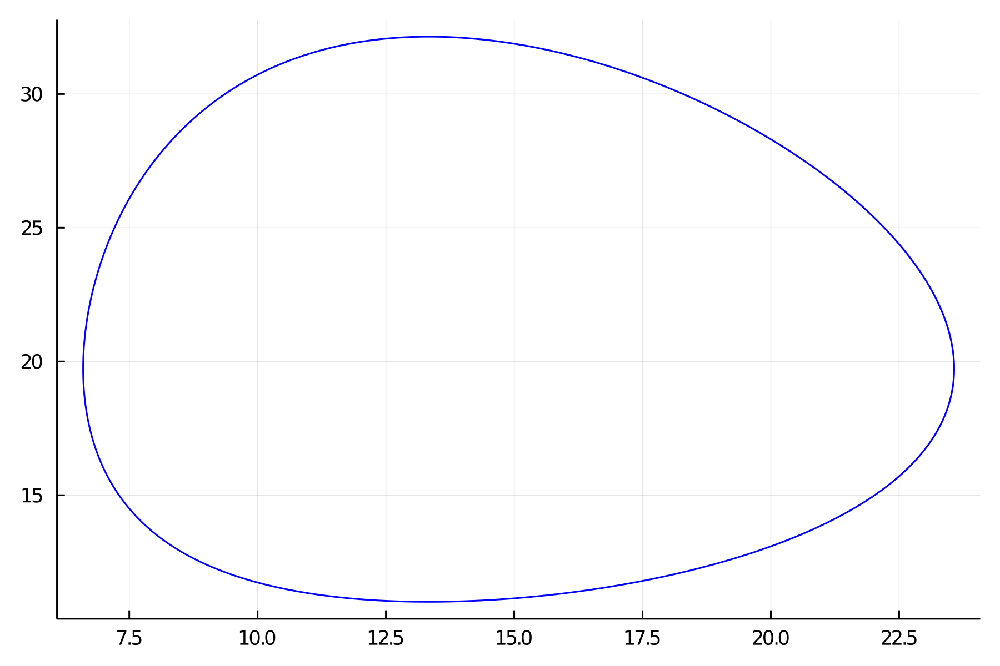
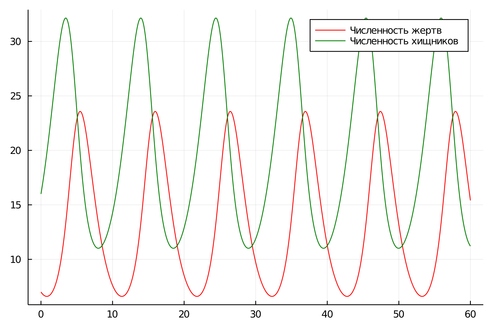

---
## Front matter
lang: ru-RU
title: "Презентация по лабораторной работе №5"
subtitle: " Модель хищник-жертва  "
author:
  - Самсонова Мария Ильинична
institute:
  - Российский университет дружбы народов, Москва, Россия
date: 03 марта 2024

## i18n babel
babel-lang: russian 
babel-otherlangs: english 
mainfont: Arial 
monofont: Courier New 
fontsize: 12pt

## Formatting pdf
toc: false
toc-title: Содержание
slide_level: 2
aspectratio: 169
section-titles: true
theme: metropolis
header-includes:
 - \metroset{progressbar=frametitle,sectionpage=progressbar,numbering=fraction}
 - '\makeatletter'
 - '\beamer@ignorenonframefalse'
 - '\makeatother'
---

# Цель лабораторной работы №5

Изучение жесткой модели хищник-жертва и построение данной моделию.


# Задачи лабораторной работы №5

1. Построить график зависимости численности хищников от численности жертв
2. Построить график зависимости численности хищников и численности жертв от времени
3. Найти стационарное состояние системы. 

# Задание лабораторной работы №5

Вариант 27:

Для модели «хищник-жертва»:

$$
 \begin{cases}
  \frac{dx}{dt} = -0.73x(t) + 0.037y(t)x(t)
  \\   
  \frac{dy}{dt} = 0.52y(t) - 0.039y(t)x(t)
 \end{cases}
$$

Постройте график зависимости численности хищников от численности жертв, а также графики изменения численности хищников и численности жертв 
при следующих начальных условиях: $x_0=7, y_0=16$
Найдите стационарное состояние системы.


  
# Код программы Julia для нестационарного состояния:

```
using Plots
using DifferentialEquations

x0 = 7
y0 = 16
a = 0.73
b = 0.037
c = 0.52
d = 0.039

function ode_fn(du, u, p, t)
    x, y = u
    du[1] = -a*u[1] + b * u[1] * u[2]
    du[2] = c * u[2] - d * u[1] * u[2]
end
```
# Код программы Julia для нестационарного состояния:

```
v0 = [x0, y0]
tspan = (0.0, 60.0)
prob = ODEProblem(ode_fn, v0, tspan)
sol = solve(prob, dtmax=0.05)
X = [u[1] for u in sol.u]
Y = [u[2] for u in sol.u]
T = [t for t in sol.t]

plt = plot(dpi=300,legend=false)
plot!(plt,X,Y,color=:blue)
savefig(plt, "lab05_1.png")

plt2 = plot(dpi=300, legend=true)
plot!(plt2, T, X, label="Численность жертв",color=:red)
plot!(plt2, T, Y, label="Численность хищников", color=:green)
savefig(plt2, "lab05_2.png")
```

# Код программы Julia для стационарного состояния:

```
using Plots
using DifferentialEquations

a = 0.73
b = 0.037
c = 0.52
d = 0.039
x0 = c / d 
y0 = a / b 

function ode_fn(du, u, p, t)
    x, y = u
    du[1] = -a*u[1] + b * u[1] * u[2]
    du[2] = c * u[2] - d * u[1] * u[2]
end
```


# Код программы Julia для стационарного состояния:

```
v0 = [x0, y0]
tspan = (0.0, 60.0)
prob = ODEProblem(ode_fn, v0, tspan)
sol = solve(prob, dtmax=0.05)
X = [u[1] for u in sol.u]
Y = [u[2] for u in sol.u]
T = [t for t in sol.t]

plt2 = plot(
  dpi=300,
  legend=true)

plot!(plt2,T,X,label="Численность жертв",color=:red)
plot!(plt2,T,Y,label="Численность хищников",color=:green)
savefig(plt2, "lab05_3.png")
```

# Результаты работы кода на Julia

{ #fig:001 width=70% height=70% }

# Результаты работы кода на Julia

{ #fig:002 width=70% height=70% }

# Результаты работы кода на Julia

{ #fig:003 width=70% height=70% }


# Код в OpenModelica для нестационарного состояния:

```
model lab05_1
Real a = 0.73;
Real b = 0.037;
Real c = 0.52;
Real d = 0.039;
Real x;
Real y;
initial equation
x = 7;
y = 16;
equation
der(x) = -a*x + b*x*y;
der(y) = c*y - d*x*y;
end lab05_1;
```

# Код в OpenModelica для стационарного состояния:
```
model lab05_2
Real a = 0.73;
Real b = 0.037;
Real c = 0.52;
Real d = 0.039;
Real x;
Real y;
initial equation
x = c / d;
y = a / b;
equation
der(x) = -a*x + b*x*y;
der(y) = c*y - d*x*y;
end lab05_2;
```

# Результаты работы кода на OpenModelica

{ #fig:004 width=70% height=70% }

# Результаты работы кода на OpenModelica

{ #fig:005 width=70% height=70% }

# Результаты работы кода на OpenModelica

{ #fig:006 width=70% height=70% }

# Анализ полученных результатов. Сравнение Julia и OpenModelica

В итоге проделанной лабораторной работы №5 мы построили график зависимости численности хищников от численности жертв, а также графики изменения численности хищников и численности жертв на языках Julia и OpenModelia. Построение модели хищник-жертва на языке OpenModelica занимает меньше строк и времени для создания графиков, нежели на языке Julia.

# Вывод 

В ходе выполнения лабораторной работы №5 была изучена модель хищник-жертва и построена модель на языках Julia и OpenModelica.
