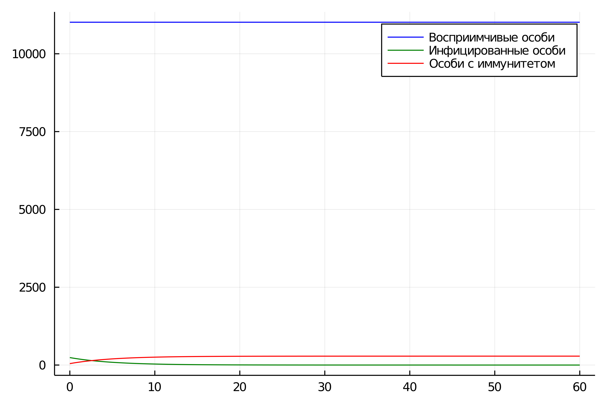
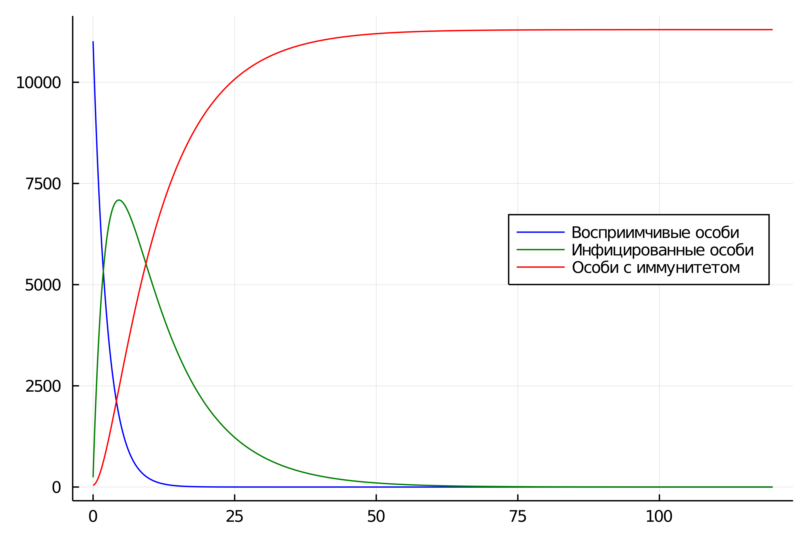
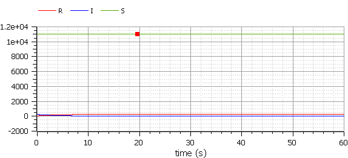
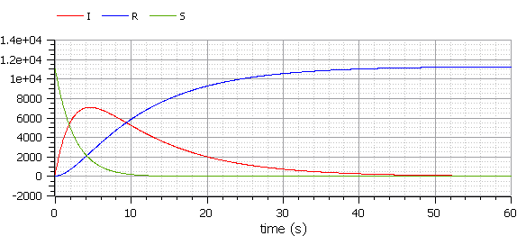

---
## Front matter
lang: ru-RU
title: "Презентация по лабораторной работе №6"
subtitle: "Задача об эпидемии "
author:
  - Самсонова Мария Ильинична
institute:
  - Российский университет дружбы народов, Москва, Россия
date: 03 марта 2024

## i18n babel
babel-lang: russian 
babel-otherlangs: english 
mainfont: Arial 
monofont: Courier New 
fontsize: 12pt

## Formatting pdf
toc: false
toc-title: Содержание
slide_level: 2
aspectratio: 169
section-titles: true
theme: metropolis
header-includes:
 - \metroset{progressbar=frametitle,sectionpage=progressbar,numbering=fraction}
 - '\makeatletter'
 - '\beamer@ignorenonframefalse'
 - '\makeatother'
---

# Цель лабораторной работы №6

Изучение и построени модели эпидемии.

# Задание лабораторной работы №6

**Вариант 27**

На одном острове вспыхнула эпидемия. Известно, что из всех проживающих на острове 
$(N=11300)$ в момент начала эпидемии $(t=0)$ число заболевших людей 
(являющихся распространителями инфекции) $I(0)=240$, А число здоровых людей с иммунитетом 
к болезни $R(0)=46$. Таким образом, число людей восприимчивых к болезни, 
но пока здоровых, в начальный момент времени $S(0)=N-I(0)-R(0)$.
Постройте графики изменения числа особей в каждой из трех групп.

Рассмотрим, как будет протекать эпидемия в случае:
1.  $I(0)\leq I^*$
2.  $I(0)>I^*$


# Задачи лабораторной работы №6

Построить графики изменения числа особей в каждой из трех групп $S$, $I$, $R$. Рассмотреть, как будет протекать эпидемия в случаях:

1.  $I(0)\leq I^*$

2.  $I(0)>I^*$

# Код программы на Julia для первого случая:

```
using Plots
using DifferentialEquations

N = 11300
I0 = 240 # заболевшие особи
R0 = 46 # особи с иммунитетом
S0 = N - I0 - R0 # здоровые, но восприимчивые особи
alpha = 0.6 # коэффициент заболеваемости
beta = 0.2 # коэффициент выздоровления

#I0 <= I*
function ode_fn(du, u, p, t)
    S, I, R = u
    du[1] = 0
    du[2] = -beta*u[2]
    du[3] = beta*I
end
```

# Код программы на Julia для первого случая:

```
v0 = [S0, I0, R0]
tspan = (0.0, 60.0)
prob = ODEProblem(ode_fn, v0, tspan)
sol = solve(prob, dtmax = 0.05)
S = [u[1] for u in sol.u]
I = [u[2] for u in sol.u]
R = [u[3] for u in sol.u]
T = [t for t in sol.t]
plt = plot(
  dpi = 600,
  legend = :topright)
plot!(plt,T,S,label = "Восприимчивые особи",color = :blue)
plot!(plt,T,I,label = "Инфицированные особи",color = :green)
plot!(plt,T,R,label = "Особи с иммунитетом",color = :red)

savefig(plt, "lab06_1.png")
```

# Код программы на Julia для второго случая:

```
using Plots
using DifferentialEquations

N = 11300
I0 = 240 # заболевшие особи
R0 = 46 # особи с иммунитетом
S0 = N - I0 - R0 # здоровые, но восприимчивые особи
alpha = 0.4 # коэффициент заболеваемости
beta = 0.1 # коэффициент выздоровления

#I0 > I*
function ode_fn(du, u, p, t)
    S, I, R = u
    du[1] = -alpha*u[1]
    du[2] = alpha*u[1] - beta*u[2]
    du[3] = beta*I
end
```
# Код программы на Julia для второго случая:
```
v0 = [S0, I0, R0]
tspan = (0.0, 120.0)
prob = ODEProblem(ode_fn, v0, tspan)
sol = solve(prob, dtmax=0.05)
S = [u[1] for u in sol.u]
I = [u[2] for u in sol.u]
R = [u[3] for u in sol.u]
T = [t for t in sol.t]

plt = plot(
  dpi=600,
  legend=:right)

plot!(plt,T,S,label="Восприимчивые особи",color=:blue)
plot!(plt,T,I,label="Инфицированные особи",color=:green)
plot!(plt,T,R,label="Особи с иммунитетом",color=:red)
savefig(plt, "lab06_2.png")
```

# Результаты работы кода на Julia для случая, когда больные изолированы

{ #fig:001 width=70% height=70% }


# Результаты работы кода на Julia для случая, когда больные могут заражать особей группы S

{ #fig:002 width=70% height=70% }


# Код программы на OpenModelica для первого случая:

Для случая $I(0) \leq I^*$:

```
model lab06_1
Real N = 11300;
Real I;
Real R;
Real S;
Real alpha = 0.6;
Real beta = 0.2;
initial equation
I = 240;
R = 46;
S = N - I - R;
equation
der(S) = 0;
der(I) = -beta*I;
der(R) = beta*I;
end lab06_1;
```

# Код программы на OpenModelica для второго случая:

Для случая $I(0)>I^*$:

```
model lab06_2
Real N = 11300;
Real I;
Real R;
Real S;
Real alpha = 0.4;
Real beta = 0.1;
initial equation
I = 240;
R = 46;
S = N - I - R;
equation
der(S) = -alpha*S;
der(I) = alpha*S - beta*I;
der(R) = beta*I;
end lab06_2;
```

# Результаты работы кода на OpenModelica для случая, когда больные изолированы

{ #fig:003 width=70% height=70% }

# Результаты работы кода на OpenModelica для случая, когда больные могут заражать особей группы S

{ #fig:004 width=70% height=70% }

# Анализ полученных результатов. Сравнение Julia и OpenModelica

В итоге проделанной лабораторной работы мы построили графики зависимости численности особенный трех групп S,I,R для случаев, когда больные изолированы и когда они могут заражать особей группы S.

Построение модели эпидемии на языке OpenModelica занимает меньше количество строк и времени, нежели аналогичное построение на Julia.

# Вывод лабораторной работы №6

В ходе выполнения лабораторной работы №6 была изучена модель эпидемии и построена модель на языках Julia и OpenModelica.